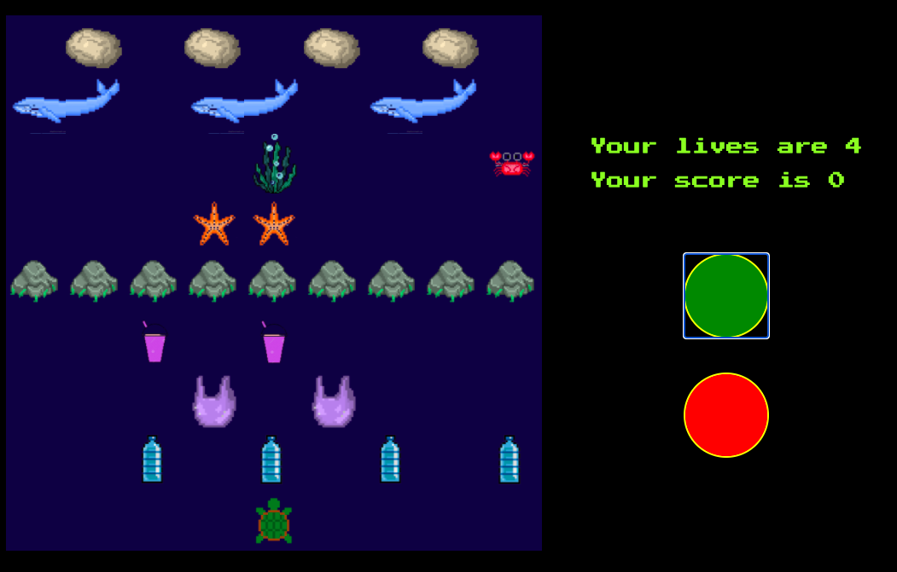
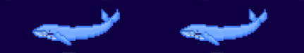
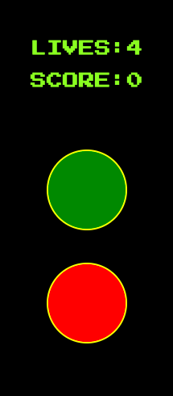
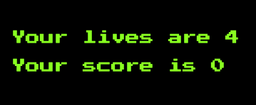
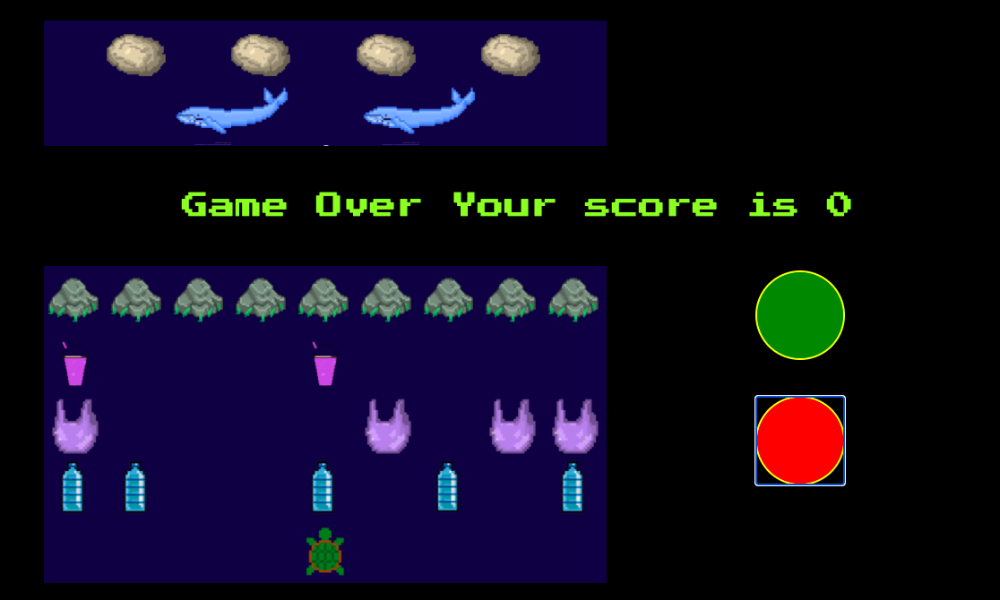
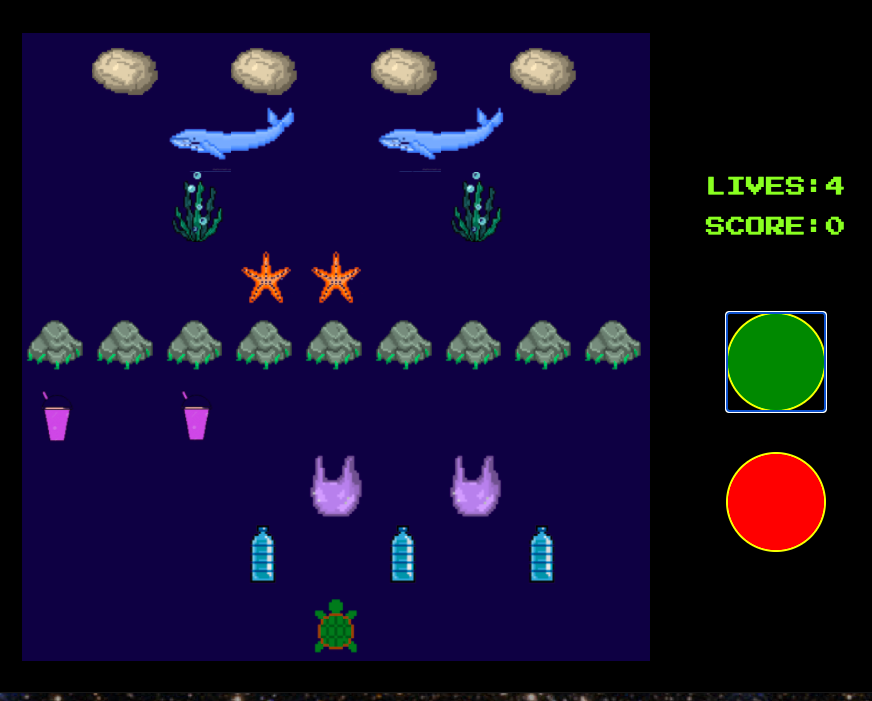
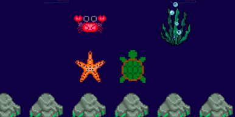

# **Project 1 - Turtles in the Ocean** 
# **Overview**
Turtles in the Ocean was my first front-end development project undertaken during my time on GA's Software Engineering Immersive course. The game is my own original version of the 80s retro videogame Frogger with an Environmental twist. I changed the theme, so no more frog but instead a turtle that is trying to survive in an ocean full of plastic objects.

Try it out here!

The game was to be built individually and completed within one week - Please see below for the project brief.

## **General Project Brief**
Build a game individually.
Be creative.
Render a game in the browser.
Design logic for winning & visually display which player won.
Include separate HTML / CSS / JavaScript files.
Stick with KISS (Keep It Simple Stupid) and DRY (Don't Repeat Yourself) principles.
Use Javascript for DOM manipulation.
Deploy your game online, where the rest of the world can access it.
Use semantic markup for HTML and CSS (adhere to best practices).

## **Project Brief**

The game should be playable for one player.
The obstacles should be auto generated and animated.
The aim of the game is to guide a turtle across a road, and a river to its home at the top of the screen.
Must detect any collision (e.g. with cars and river).
Timers should be present.



## **Techonologies Used**

- HTML5
- CSS3
- JavaScript (ES6)
- Git and GitHub
- Google Fonts
- Adobe

## **Approach**
I planned out the build in sections, and used these sections to split my week into achievable deadlines. My first goal was to create an MVP - a basic version of my game which worked. I devoted 2 days to this. After this, I spent a further 2 days fixing bugs, creating additional features and styling my game (including creating my pixel pieces). The final day was focused on finishing styling and refactoring some of my code.

## **Days 1 & 2**

### **The Grid**
I began by creating and placing all of the components needed to play the game and I utilised the forEach() array method to place all of my components on to the grid. Example:
```
plasticBagPosition.forEach(bag => {
    setInterval(() => {
      if (bag > 61) {
        cells[bag].classList.remove('plastic-bag')
        bag = 53
        return
      }
      // if (bag >= 53 && bag < (width * (width - 1))) {
      cells[bag].classList.remove('plastic-bag')
      bag += 1
      cells[bag].classList.add('plastic-bag')
    }, 1000)
  })

```

## **Rendering the Game**
The next step was to render my game. In order to do this I created a render game function:

### **Moving Parts**
#### **User generated**
##### **The turtle**
The turtle is moved by the user using the arrow keys - included in the else statement keydown event listener. This event listener also considers the game over logic, game points and render game function with each click.
```
cells[turtle].classList.add('little-turtle')
    if (key === 'ArrowDown' && !(turtle > (width ** 2) - width - 1)) {
      cells[turtle].classList.remove('little-turtle')
      turtle += width
      cells[turtle].classList.add('little-turtle')
      // ? 'ArrowLeft' moves turtle left -- but only if he's not on the left column!
    } else if (key === 'ArrowLeft' && !(turtle % width === 0)) {
      cells[turtle].classList.remove('little-turtle')
      turtle -= 1
      cells[turtle].classList.add('little-turtle')
      // ? 'ArrowRight' moves turtle right -- but only if he's not on the right column!
    } else if (key === 'ArrowRight' && !(turtle % width === width - 1)) {
      cells[turtle].classList.remove('little-turtle')
      turtle += 1
      cells[turtle].classList.add('little-turtle')
      // ? 'ArrowUp' moves turtle up -- but only if he's not in the top row!
    } else if (key === 'ArrowUp' && !(turtle < width)) {
      cells[turtle].classList.remove('little-turtle')
      turtle -= width
      cells[turtle].classList.add('little-turtle')
    }

```

#### **Automated Elemenents**
- The whales
- The crabs
- The seaweeds


- The plastic cups
- The plastic bottles
- The plastic bags


These are all automated with functions using set intervals to create movement. Example:
```
 plasticBagPosition.forEach(bag => {
    setInterval(() => {
      if (bag > 61) {
        cells[bag].classList.remove('plastic-bag')
        bag = 53
        return
      }
      // if (bag >= 53 && bag < (width * (width - 1))) {
      cells[bag].classList.remove('plastic-bag')
      bag += 1
      cells[bag].classList.add('plastic-bag')
    }, 1000)
  })

```


##### **Whales Rendering**
Whales are rendered by dividing the image in two and assigning each one to a specific cell:



###### **Whales and Star-Fish Automation**
Whales automation required a bit of abstraction so that the two images were able to move in syncronic float. For the Whales, I used a for loop in this case because it suited the best the task of moving the alongated image:
```
 setInterval(() => {
    for (let index = 0; index < whalePosition.length; index++) {
      cells[whalePosition[index]].classList.remove('whale1')
      cells[whalePosition[index] + 1].classList.remove('whale2')
      whalePosition[index] -= 1
      cells[whalePosition[index]].classList.add('whale1')
      cells[whalePosition[index] + 1].classList.add('whale2')
      if (whalePosition[index] === turtle || whalePosition[index] - 1 === turtle) {
        console.log(whalePosition, turtle)
        cells[turtle].classList.remove('little-turtle')
        turtle -= 1
        cells[turtle].classList.add('little-turtle')
        if (turtle < 9) {
          lives -= 1
          loosingLives()
          cells[turtle].classList.remove('little-turtle')
          cells[76].classList.add('little-turtle')
          turtle = 76
        }
      }
      if (whalePosition[index] < 9) {
        cells[whalePosition[index] + 1].classList.remove('whale2')
        cells[whalePosition[index]].classList.remove('whale1')
        whalePosition[index] = 17
      }
    }
  }, 1000)
  ```

In case of the star-fishes I used a for each statement as for the other floating elements:
```
starFishPosition.forEach((star, index) => {
    setInterval(() => {
      if (star === turtle) {
        cells[turtle].classList.remove('little-turtle')
        turtle += 1
        cells[turtle].classList.add('little-turtle')
        if (turtle === 36) {
          loosingLives()
        }
      }
      if (star > 26 && star < (width * (width - 1))) {
        cells[star].classList.remove('star-fish')
        star += 1
        cells[star].classList.add('star-fish')
      }
      if (star > 35) {
        cells[star].classList.remove('star-fish')
        star = 27
        cells[star].classList.add('star-fish')
      }
    }, 2000)
  })
  ```


#### **Collision Detection**
The turtle will lose a life/die if:

- If it eats a plastic bottle.
- If it eats a plastic bag.
- If it hits either edge of the grid.
- If it doesn't jump on the sea rock.
- When the turtle dies you want it to be removed from its current position and re-positioned at the start of the game. In order to do this I created specific collision functions for each of these cases:
```
function checkPlasticBagCollision() {
    if (cells[turtle].classList.contains('plastic-bag')) {
      const collisionHappened = turtle
      cells[turtle].classList.add('skeleton')
      setTimeout(() => {
        cells[collisionHappened].classList.remove('skeleton')
      }, 1000)
      loosingLives()
      cells[turtle].classList.remove('little-turtle')
      cells[turtle].classList.remove('plastic-bag')

      // cells[turtle].classList.remove('little-turtle')
      cells[76].classList.add('little-turtle')
      turtle = 76
    }
  }

```

This function deducts a life every time the frog dies, updates and alerts how many lives you have left and takes into consideration what happens when lives = 0.
```
function loosingLives() {
    removeTurtle(turtle)
    addTurtle(turtle = 76)
    audioPlayer.src = './sound/sound-frogger-squash.wav'
    audioPlayer.play()
    setTimeout(wait, 500)
    function wait() {
      // lives[lives - 1]
      lives--
      livesDisplay.innerHTML = lives
      scoreDisplay.innerHTML = score
      if (lives === 0) {
        gameOver()
        resetGame()

      }
    }
  }

```

#### **Winning and loosing**
I created a gameOver() function which is for both when you lose a life. I also created a resetGame() function for when the game has officially ended (i.e time is up, you have no lives remaining or you have won). This function resets all of the pieces/functionality of the game:

- The timer
- The counters (lives and points)
- The movement (clears intervals and removes event listeners)
- Repositions the turtle back on the starting tile (76)
- To create both I had to consider the conditions that needed to be met in order for the game to be reset, over or for the player to have won the game.

```
 function removeTurtle() {
    cells[turtle].classList.remove('little-turtle')
  }
  function addTurtle() {
    cells[turtle].classList.add('little-turtle')
  }
  function gameOver() {
    console.log('game over')
  }
  if (turtle === 1 || turtle === 3 || turtle === 5 || turtle === 7) {
    loosingLives()
  }

```
```
function resetGame() {
  lives = 4
  score = 0
  livesDisplay.innerHTML = `Your lives are ${lives}`
  scoreDisplay.innerHTML = `Your score is ${score}`

  intervalId = 0
  
  clearInterval(intervalId)
  popup1.style.display = 'block'
  popup1.innerHTML = `Game Over Your score is ${score}` 
}

```

## **Days 3 & 4**
Days 3 and 4 were reserved for bug fixing (see bugs and challenges section), adding any additional features, styling my game with CSS and animating/creating my game pieces/ add buttons that are original replicas of 80s arcade videogames. The overall style is minimalistic and alligned to the 80s aestetics:




#### **Points System**
I created the points system on day 5.
The player can gain (and lose) points throughout the game. Points are gained by eating crabs or seaweeds that are scattered throughout the tiles. The player will lose points each time the turtle eats plastic cups:
```
function checkCrabCollision() {
    if (cells[turtle].classList.contains('crab')) {
      const collisionHappened = turtle
      cells[turtle].classList.add('rainbow')
      setTimeout(() => {
        cells[collisionHappened].classList.remove('rainbow')
      }, 1000)
      score += 200
      audioPlayer.src = './sound/sound-frogger-coin-in.wav'
      audioPlayer.play()
      scoreDisplay.innerHTML = score
      cells[turtle].classList.remove('little-turtle')
      cells[turtle].classList.remove('crab')
    }
  }

```




I also had some fun with my CSS styling and created a popup modal that let you know how many lives you have left, or whether you have won or lost the game:



As a bonus feature I added 80's retro arcade sound effect for avery game events:
```
start.addEventListener('click', () => {
  // ? This stops you from creating multiple set intervals
  if (intervalId !== 0) {
    return
  }
  audioPlayer.src = './sound/frogger-music.mp3'
  audioPlayer.play()
  popup1.style.display = 'none'
  cellsAll.style.display = 'flex'
```

#### **Last day**
Some minor code refactoring and I added some new code so that the sea-stars and whales change position with each new game and added some additional styling of a divider to the ocean.



## **Challenges**
CSS specificity! I had an issue getting the turtle to appear on top of the whale if the whale also had a background image. This was eventually fixed by being incredibly specific with CSS classes:
```
div.little-turtle {
  background-image: url('images/turtle.png');
  background-size: cover;
  background-position: center;
}
.skeleton {
  background-image: url('https://i.pinimg.com/originals/74/ec/06/74ec0622c54c403fa46e6d55289bf672.jpg');
  background-size: cover;
  background-position: center;
}
.cloud{
  background-image: url('images/cloud1.png');
  background-size: cover;
  background-position: center;
}
.rainbow{
  background-image: url('images/rainbow.png');
  background-size: cover;
  background-position: center;
}
.rock-barrier{
background-image: url('http://pixelartmaker-data-78746291193.nyc3.digitaloceanspaces.com/image/3d079d40b6d7ac5.png');
background-size: cover;

```

Automated movement is rendered by using set intervals. Also see code snippet above. Originally had all of the positions hard coded before adding those code snippets in to the render game function instead.

```
seaWeedPosition.forEach(weed => {
    setInterval(() => {
      if (weed >= 18 && weed < (width * (width - 1))) {
        cells[weed].classList.remove('sea-weed')
        weed = weed += 2
        cells[weed].classList.add('sea-weed')
      }
      if (weed > 27) {
        cells[weed].classList.remove('sea-weed')
        weed = 18
      }
    }, 1000)
  })

```



## **Victories**
Managed to fix a lot of the little bugs mentioned above, managed my time well so I had time to add it the additonal crab points feature, created a working game!

## **Bugs**
If the start button is clicked more than once, all of the automated movement speeds up [NOT-FIXED]
When sea-friends are placed randomly at the beginning of each game, they are sometimes placed under turtle so they can't be seen.

## **Lesson Learned**
I didn't design this game mobile first, so it is not responsive. For future projects I will begin by designing/building mobile first.


